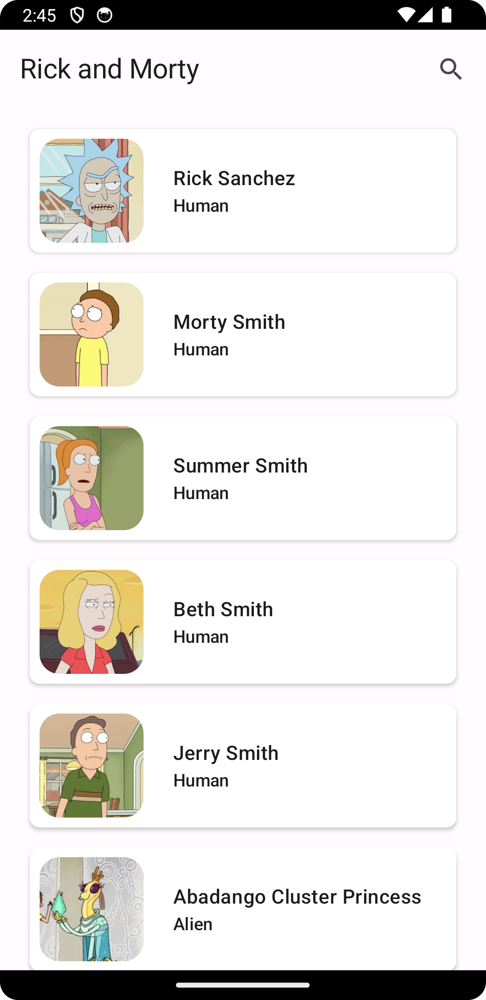
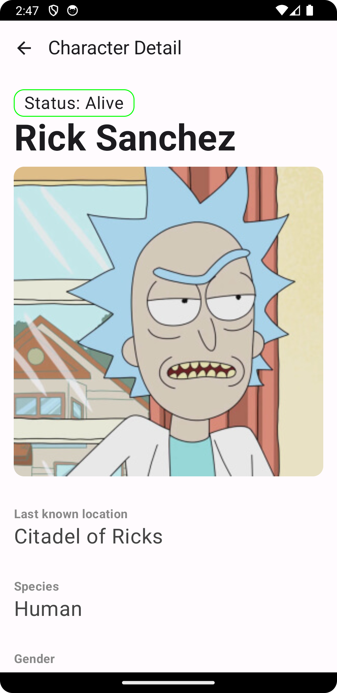
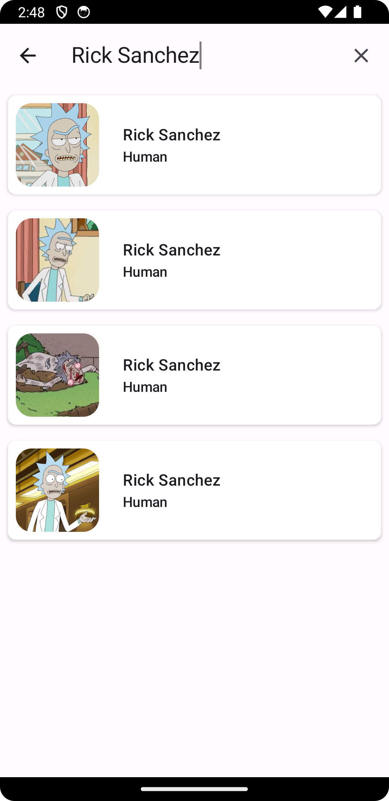

# Rick and Morty Android
*  This is a sample app that implements the Kotlin Multiplatform framework. 
*  The app uses shared logic. 
*  The app consumes data from the open [Rick And Morty Api](https://rickandmortyapi.com/).

### Screenshots   

|  |  |  |
|-------------------------------------------------------------|--------------------------------------------------------------|---------------------------------------------------------------|

 

### Tech Stack:

*   Kotlin Coroutine and Kotlin Multiplatform framework with shared logic.
*   Android and iOS UI are in separate codebases.
*   User Interface built with **[Jetpack Compose](https://developer.android.com/jetpack/compose)**
*   A single-activity architecture, using **[Navigation Compose](https://developer.android.com/jetpack/compose/navigation)**.
*   A presentation layer that contains a Compose screen (View) and a **ViewModel** per screen (or feature).
*   The networking layer that uses **[Retrofit](https://square.github.io/retrofit/)**
*   Reactive UIs using Coroutine **[Flow](https://developer.android.com/kotlin/flow)** and **[coroutines](https://kotlinlang.org/docs/coroutines-overview.html)** for asynchronous operations.
*   ViewModels integration tests using **[Turbine](https://github.com/cashapp/turbine)**
*   End to end testing using **[Compose Test Rule](https://developer.android.com/reference/kotlin/androidx/compose/ui/test/junit4/ComposeTestRule)** and **[HiltAndroidRule](https://dagger.dev/api/latest/dagger/hilt/android/testing/HiltAndroidRule.html)**
*   Dependency injection using [Hilt](https://developer.android.com/training/dependency-injection/hilt-android).

